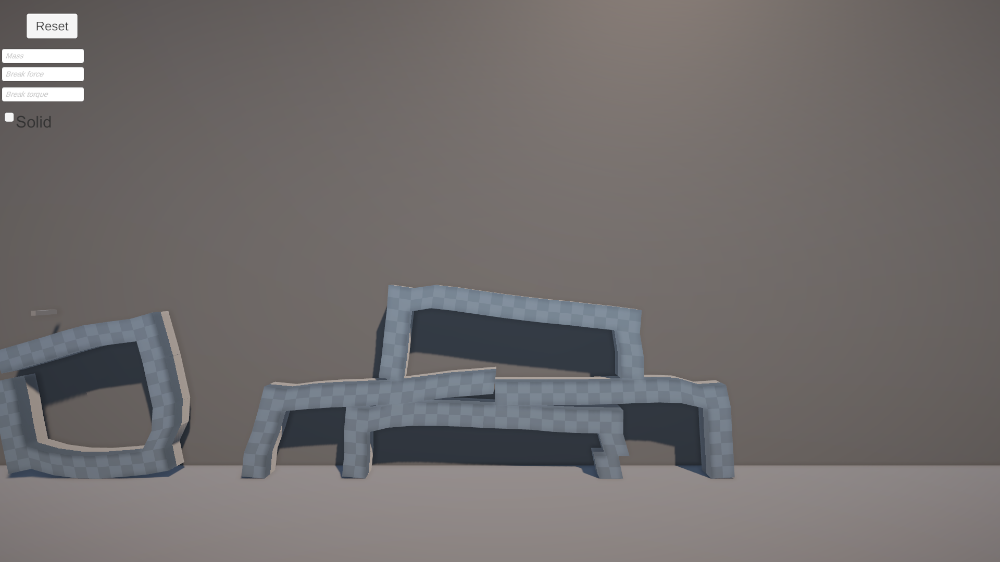

# ShapeDrawer
Example project on how to make destructible system on Unity with ConfigurableJoint

## Features
1. Object is drawn with mouse
2. Drawn objects connects when mouse is not pressed
3. Break force and break torque can be configured
4. Mass can be configured
5. Drawn objects can be toggled solid (instead of ConfigurableJoint it will use root and child objects)
6. EarlierObject is used to determite new objects vertices to achieve smoother line 

  
